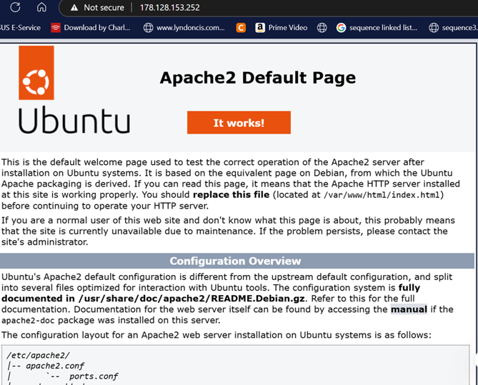
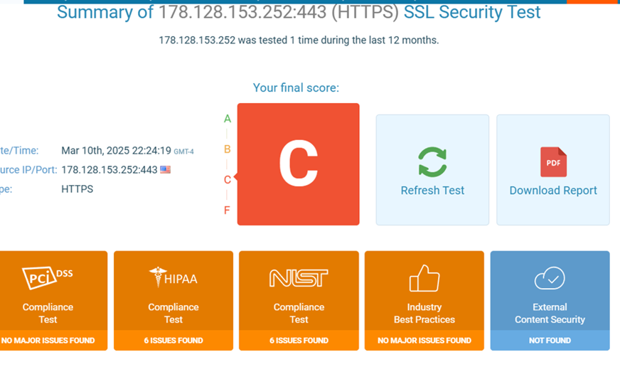
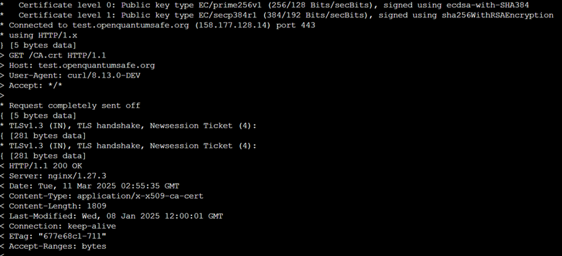

# Post-Quantum OpenSSL TLS Lab

## Project Overview
This project demonstrates the configuration and evaluation of SSL/TLS security using Apache, OpenSSL, and post-quantum cryptography concepts.

## Skills Demonstrated
- TLS/SSL configuration
- Apache HTTPS setup
- OpenSSL security testing
- Post-quantum cryptography concepts
- Security validation and remediation

## Security Problem
Initial SSL/TLS testing showed weak configuration and an insecure connection.

## Remediation
- Enabled HTTPS on Apache
- Installed and configured SSL/TLS
- Evaluated post-quantum cryptography concepts
- Tested secure TLS communication

## Risk / Control Mapping
| Risk | Control |
|---|---|
| Weak TLS configuration | Harden SSL/TLS settings |
| Future quantum risk | Evaluate post-quantum algorithms |
| Insecure HTTP traffic | Enforce HTTPS |

## Screenshots

---

---

## GRC Relevance
This project demonstrates how encryption, secure configuration, and cryptographic readiness support confidentiality and long-term risk reduction.
